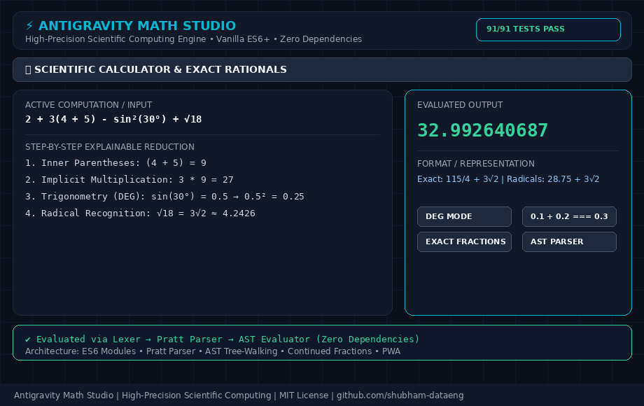

# Antigravity Math Studio & Scientific Computing Engine

An industrial-strength, zero-dependency **Scientific Computing Studio and Mathematical Workspace** built with modern ES6+ architecture. Designed as a high-precision instrument for students, scientists, and software engineers.

<p align="center">
  <a href="assets/scientific-calculator-demo.gif">
    
  </a>
  <br>
  <em>Live Demo: Lexer-Parser AST engine, exact rational arithmetic, reactive Soulver-style worksheets & 2D canvas grapher</em>
</p>

---

## 🌟 Key Highlights & Architectural Transformations

Unlike conventional calculators that rely on naive string replacement or dangerous runtime code evaluation (`eval` / `Function`), **Antigravity Math Studio** is powered by a custom **Lexer → Parser → AST → Tree-Walking Evaluator** pipeline with exact rational arithmetic, step-by-step mathematical explanations, and reactive multi-line worksheets.

- **Zero External Dependencies**: 100% self-contained vanilla ES6 modules running offline in any modern browser.
- **Robust Syntax & Operator Precedence**: Full BODMAS/PEMDAS compliance, implicit multiplication (`2π`, `3(4 + 5)`, `5sin(30)`), superscript powers (`sin²(30)`, `x²`), and nested functions.
- **Floating-Point Noise Elimination**: `0.1 + 0.2 === 0.3`. Decimal normalization and Stern-Brocot continued fractions.
- **Smart Multi-Format Results**: Instant toggle between Decimal, Exact Fraction (`3/4`), Scientific (`7.5 × 10⁻¹`), Engineering (`750 × 10⁻³`), Percentage (`75%`), and Exact Radicals (`√18` &rarr; `3√2`).
- **Explainable Math Engine ("How was this calculated?")**: Transparent step-by-step reduction of mathematical expressions following BODMAS rules.
- **Live Expression Intelligence**: Real-time syntax validation, distinguishing incomplete expressions from fatal errors, with live result preview.

---

## 🧮 8 Dedicated Computing Modes

### 1. 🧮 Scientific Calculator
- Standard & scientific keypad with secondary shift (`2nd`) toggle for inverse trigonometric & hyperbolic functions.
- Angle Modes: **Degrees (DEG)**, **Radians (RAD)**, and **Gradians (GRAD)**.
- Memory Bank (`M+`, `M−`, `MR`, `MC`) and variable scopes (`ans`, `π`, `e`, `φ`, `τ`).
- Actionable error diagnostics: *"Cannot divide by zero"*, *"tan(90°) is undefined (vertical asymptote)"*, *"Square root of negative number is not real"*.

### 2. 📝 Dynamic Reactive Calculation Workspace
- Multi-line calculation strip (inspired by Soulver and Jupyter notebooks).
- Define variables: `radius = 7`, `area = pi * radius^2`.
- Reference previous lines: `L1 + 15`, `L2 / L1`.
- Changing any line reactively updates all dependent calculations downstream.
- Export calculation sheets directly to Markdown or plain text.

### 3. 📈 Interactive 2D Graphing Studio
- HTML5 Canvas function plotter with Cartesian grid and auto-scaling axes.
- Plot multiple simultaneous curves (e.g. $f_1(x) = \sin(x)$, $f_2(x) = x^2 - 4$).
- Smooth pan (click & drag / touch) and zoom (mouse wheel / touch pinch).
- Interactive hover crosshair with exact coordinate readout badge $(x, y)$.

### 4. 🔢 Equation Solver & Derivation Engine
- **Linear Equations**: $ax + b = c$ with step-by-step balance-sheet algebra.
- **Quadratic Equations**: $ax^2 + bx + c = 0$ with discriminant $\Delta = b^2 - 4ac$, vertex, and real/complex conjugate roots with complete quadratic formula derivations.
- **Numerical Root Finder**: Hybrid Newton-Raphson / Bisection solver for arbitrary non-linear and transcendental equations $f(x) = 0$.

### 5. 💻 64-Bit Programmer Calculator
- Interactive 64-bit visual bitboard: click any bit (0–63) to toggle state.
- Simultaneous representation in **HEX**, **DEC**, **OCT**, and **BIN** (formatted in 4-bit nibbles).
- Word Size masking: `QWORD` (64-bit), `DWORD` (32-bit), `WORD` (16-bit), and `BYTE` (8-bit).
- Unsigned and Signed (Two's Complement) integer modes.
- Full bitwise operations: `AND`, `OR`, `XOR`, `NOT`, `NAND`, `NOR`, `LSH` ($<<$), `RSH` ($>>$), `ROTL`, `ROTR`.

### 6. ▦ Matrix Algebra Studio
- Multi-dimensional matrix input (format: `1 2; 3 4`).
- Operations: Matrix Addition, Subtraction, Matrix Multiplication, Determinant $\det(A)$, Transpose $A^T$, Trace $\text{tr}(A)$, and Matrix Inverse $A^{-1}$ via Gauss-Jordan elimination.

### 7. 📊 Descriptive Statistics & Distribution Analysis
- Input raw comma/space-separated datasets (e.g. `12, 15, 18, 20, 25, 30, 32`).
- Metrics: Sample Count ($n$), Sum ($\Sigma x$), Mean ($\mu$), Median, Mode, Min, Max, Range, Quartiles ($Q_1, Q_3$, $\text{IQR}$), Sample Variance ($s^2$), Sample Standard Deviation ($s$), and Standard Error of Mean ($\text{SEM}$).
- Interactive frequency distribution histogram.

### 8. 🔄 Precision Unit Converter & Natural Language Matcher
- 12 engineering categories: Length, Mass, Temperature, Area, Volume, Speed, Time, Pressure, Energy, Power, Digital Data, and Angle.
- Natural Language Input: Type `10 km to miles`, `25 C to F`, or `100 MB to GB` directly in the main calculator bar for instant conversion.

---

## ⏱ Calculation History 2.0 & Variable Bank

- Searchable calculation history with real-time text query filtering.
- Pin / favorite important calculations (pinned calculations float to top).
- One-click copy or reload previous expressions into the active formula.
- Export history to Text or JSON.
- Interactive Variable & Memory Bank: inspect and reuse `M`, `ans`, `pi`, `e`, `phi`, `tau`, or user-defined variables.

---

## 🏗 Modular Project Architecture

```
scientific-calculator/
├── index.html                   # High-performance HTML5 semantic UI
├── style.css                    # Precision instrument design system (tokens, light/dark themes)
├── app.js                       # Application entry point coordinating subsystems
├── calc-worker.js               # Sandboxed Web Worker for heavy background computations
├── manifest.json                # PWA offline installation manifest
├── service-worker.js            # Stale-while-revalidate PWA offline cache
├── engine/                      # Mathematical Core Engine (Zero Dependencies)
│   ├── tokens.js                # Token definitions & Lexer/Tokenizer with location tracking
│   ├── ast.js                   # Abstract Syntax Tree (AST) node definitions
│   ├── parser.js                # Pratt/Recursive-Descent Parser (BODMAS, implicit mult, powers)
│   ├── fractions.js             # Continued fractions, Stern-Brocot tree, and radical recognition
│   ├── evaluator.js             # AST Tree-Walking Evaluator (domains, angle modes, scopes)
│   ├── explainer.js             # Explainable step-by-step calculation breakdown
│   ├── solver.js                # Linear, quadratic, and numerical equation solver
│   ├── matrix.js                # Linear algebra and 2D matrix engine
│   ├── stats.js                 # Descriptive statistics and distribution analyzer
│   └── units.js                 # 12-category unit converter & natural language parser
├── modules/                     # Interactive Feature Modules
│   ├── ui.js                    # Master UI controller, keyboard dispatcher, themes
│   ├── history.js               # History 2.0 and Memory Bank manager
│   ├── grapher.js               # Interactive 2D Canvas function plotter
│   ├── programmer.js            # 64-bit programmer mode and bitboard controller
│   └── workspace.js             # Reactive multi-line calculation worksheet
└── tests/                       # Test Suite & QA Automation
    ├── engine-tests.js          # Automated Node.js test suite (91/91 passing)
    ├── test-runner.html         # Interactive in-browser test runner
    └── calculator-test-suite.js # Comprehensive regression test suite
```

---

## 🚀 Running Locally

Because Antigravity Math Studio uses native ES6 modules and standard web APIs, **no build step, bundler, or package installation is required**.

```bash
# Clone the repository
git clone https://github.com/shubham-dataeng/scientific-calculator.git
cd scientific-calculator

# Start any standard local HTTP server
python3 -m http.server 8000
# or
npx serve .

# Open in your browser
http://localhost:8000
```

---

## 🧪 Testing & Verification

The project includes an automated test suite verifying arithmetic, BODMAS precedence, transcendental functions, floating-point precision, domain checks, equation solving, matrix algebra, statistics, programmer mode, and unit conversions.

```bash
# Run automated test suite via Node.js
node tests/engine-tests.js

# Or open in your browser
tests/test-runner.html
```

---

## ⌨️ Keyboard Shortcuts

| Shortcut | Action |
| :--- | :--- |
| `0-9`, `.`, `+`, `-`, `*`, `/`, `^`, `%`, `(` `)` | Type expressions directly |
| `Enter` | Calculate result |
| `Backspace` | Delete previous character |
| `Escape` | Clear calculation display |
| `Ctrl + C` | Copy result to clipboard |
| `Ctrl + H` | Open keyboard shortcuts modal |

---

## 📄 License

MIT License. Designed and engineered for high-precision scientific computing.
